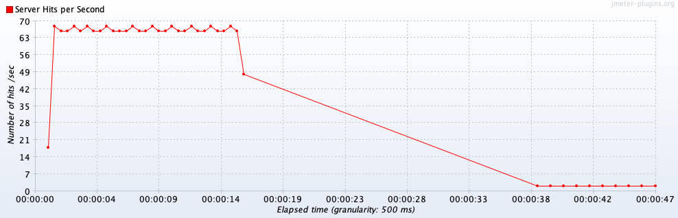

# JMeter Test Framework

## Command Line Instructions:

`paht/to/jmeter -n -t Test Plan.jmx` 

## Set Up Machine

Install Apache JMeter from [https://jmeter.apache.org/download\_jmeter.cgi](https://jmeter.apache.org/download_jmeter.cgi)

## About Project
This project is built to demonstrate the load on a dummy website https://demo.opencart.com/ with 1000 users landing on the homepage in span of 15 seconds.

## Project Structure
Lets see on how the parameters and response are handled inside the jmeter setup.


First on a Test plan I have created 2 thread groups  

1. **_PeakLoadThreadGroup_** 
2. **_OffPeakLoadThreadGroup_**. 

All the input paramters to the these Thread Grouds are passed via properties file where we provide the below parameters
```python
# thread properties

#peak load

group1.usercount=1000
group1.rampup=15
group1.duration=15000

#non peak load

group2.usercount=10
group2.rampup=10
group2.duration=15000

#single user

group3.usercount=1
group3.rampup=1
group3.duration=15000
```

Each ThreadGroup is assiged with a Sampler HTTP Requests  (**_HomePageHttpLoadRequest_**)and Each request parmeters are passed from properties file. If we have more environments like QA, DEV , PROD. We can create multiple properties file accordingly to make it mode modular.
```python
# Environment Request properties

test.environment.hostname=demo.opencart.com
test.environment.port=
test.environment.protocol=https`
```

## Assertions 

Now that we got the Thread groups and HTTP Request setup, we need to add the Assertions to make sure what we wants to valid once the requests are triggered.

So, here we are trying to validate response duration for peak and off peak load of the webapplications home page. We will be adding **_Duration Assertion_** under each of the HTTP Requests.

As optimal application response time for modern day web applications should be less than 5 sec (5000 ms), we will try to make the Duration Assertion fail the tests which are beyond 15 sec.


## Results 

Once the execution is started and completed we can see the results in multiple Listeners which we setup in the project.

So here I have used 3 types of Listerners to view the results.

```python
1) jp@gc - Response Times Over Time
2) jp@gc - Hits per Second
3) View Results Tree
4) View Results in Table
```

First 2 Listerners are graphical representation of results 

## Response Times Over Time


## HitsPerSecond


## Aggregation results


## Analysis of results

As displayed in the above results, when 1000 users fires the home page in span of 15 seconds then the > _**average response time observed is 5314.44	ms and minimum response time of 784ms along with maximum response time of 14557 ms**_

Below are stats of the 1000 users in 15 seconds


Below are stats of the 10 users in 10 seconds


```python

## Questions and Responses:
  a) Explain the test in details --Done in details above 

  b) Did the load test have an impact on web application response time? 
  Ans: Yes, as the load gets increased the response of the application to respond is increased  gradually and same can be plotted in the ResponseTimesOverTime graph.
  Started with 784ms but as load increased it hit a maximum of 14557ms
  
  c) What is the optimal application response time for modern day web applications?
  Ans: Optimial time for an application to respond for a HTTP Request is around 350 to 500 ms. Where in the real time when we actually load the application , we can assume an optimal response time of 2500ms to 3000ms.
  Imagine we run via jmeter webdriver plugin, these response will be all different as that more realistic as browsers are involved.

  d) Analyze few HTTP/S responses --Done in details above

```


